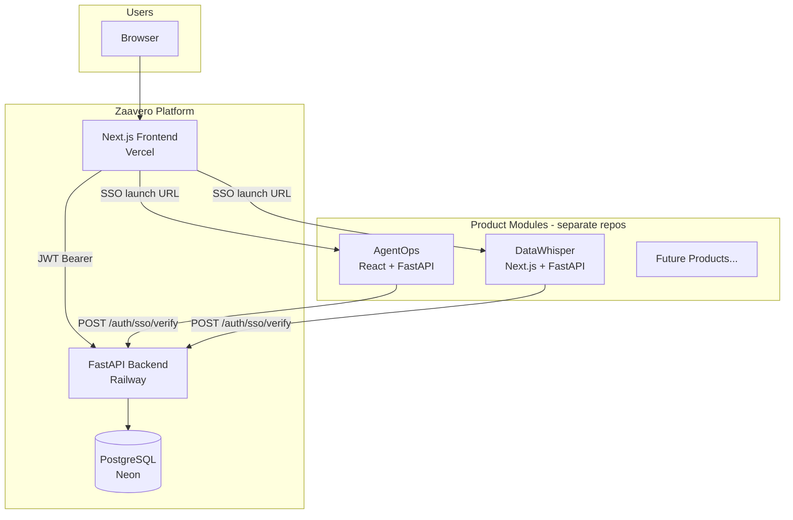

# Zaavero Platform Architecture

## Vision

Zaavero is a **multi-product SaaS platform** — not a single application. It provides:

- One user account
- One workspace (team)
- One billing relationship
- One settings experience
- Many product modules (AgentOps, DataWhisper, future products)

Inspired by Atlassian, Google Workspace, and AWS console patterns.

---

## System diagram



---

## Repository layout

```
Zaavero/
├── frontend/          # Platform UI (landing, dashboard, marketplace)
├── backend/           # Platform API (auth, billing, product registry)
├── infra/             # Docker Compose for local Postgres
└── docs/              # Architecture & integration guides
```

**Separate repositories** (integrated as modules):

- `github.com/pankaj779/AgentOps-Databricks-app`
- `github.com/pankaj779/ai-data-analyst`

---

## Database schema

### Core entities

| Model | Purpose |
|-------|---------|
| `Workspace` | Team container (slug, join policy) |
| `User` | Platform user (email, role, workspaceId) |
| `Product` | Catalog entry synced from module registry |
| `WorkspaceProduct` | Enablement + per-workspace config |
| `PlatformPlan` | Subscription tiers (free/starter/pro/enterprise) |
| `BillingAccount` | Stripe customer ID, plan tier, status |
| `Subscription` | Active subscription + period |
| `SubscriptionProductAddon` | Per-product billing add-ons |
| `FeatureFlag` | Platform/product feature keys |
| `WorkspaceFeatureFlag` | Workspace overrides |
| `ActivityLog` | Audit trail |
| `Announcement` | Platform announcements |

### Roles

| Role | Permissions |
|------|-------------|
| `ADMIN` | Enable/disable products, manage team, billing |
| `ANALYST` | Launch products, view dashboard |
| `VIEWER` | Read-only platform access |

---

## Authentication flow

### Platform login

1. User submits credentials on `/login`
2. NextAuth calls `POST /auth/login`
3. Backend returns JWT with claims: `sub`, `email`, `role`, `wid`, `wslug`, `products[]`
4. Frontend stores token in NextAuth session as `accessToken`
5. All API calls use `Authorization: Bearer {token}`

### SSO product launch

1. User clicks **Launch** on enabled product
2. Frontend calls `POST /products/{slug}/launch`
3. Backend creates 5-minute `sso_launch` JWT
4. Returns `{ launch_url, sso_token }` — URL includes `?zaavero_token=...`
5. Product app reads token, calls `POST /auth/sso/verify` on platform API
6. Product establishes local session from verified claims

**Integration task for AgentOps/DataWhisper:** Add middleware to accept `zaavero_token` query param and validate against Zaavero platform API.

---

## Product module framework

### Registration (`product_registry.py`)

Each product is defined as a `ProductModuleDefinition`:

```python
ProductModuleDefinition(
    slug="agentops",
    name="AgentOps",
    launch_url_key="agentops_launch_url",  # env var
    module_config={...},                   # routes, integrations
    feature_flags=[...],
    min_plan_tier="starter",
    addon_price_cents=4900,
)
```

### Sync to database

```bash
python scripts/seed_catalog.py
```

Upserts products, plans, and feature flags.

### Enablement

- Admin calls `POST /products/{slug}/enable`
- Creates `WorkspaceProduct` row with status `ACTIVE`
- Enforces plan tier + max products limit

---

## Billing architecture (Stripe-ready)

### Model

- **Platform subscription** — tier determines max users/products
- **Product add-ons** — optional per-product charges

### Plans

| Tier | Users | Products | Price |
|------|-------|----------|-------|
| free | 3 | 1 | $0 |
| starter | 10 | 2 | $99/mo |
| pro | 50 | 5 | $299/mo |
| enterprise | ∞ | ∞ | Custom |

### Stripe integration points

| Endpoint | Future behavior |
|----------|-------------------|
| `POST /billing/checkout-session` | Create Stripe Checkout |
| `POST /billing/portal-session` | Customer portal |
| Webhook handler (TBD) | Sync subscription status |

Fields ready: `stripeCustomerId`, `stripeSubscriptionId`, `stripePriceId*`

---

## Feature flags

Three-level resolution:

1. **Platform defaults** — `FeatureFlag.defaultOn`
2. **Product defaults** — `ProductFeatureFlag.defaultOn`
3. **Workspace overrides** — `WorkspaceFeatureFlag.enabled`

Service: `app/services/feature_flags.py`

---

## Deployment topology

| Environment | Frontend | Backend | Database |
|-------------|----------|---------|----------|
| Production | Vercel (zaavero.com) | Railway | Neon |
| Local | localhost:3000 | localhost:8000 | Docker :5433 |

### Environment variables

**Backend:** `DATABASE_URL`, `JWT_SECRET`, `CORS_ORIGINS`, `AGENTOPS_LAUNCH_URL`, `DATAWHISPER_LAUNCH_URL`, `STRIPE_*`

**Frontend:** `NEXTAUTH_SECRET`, `NEXTAUTH_URL`, `NEXT_PUBLIC_API_URL`, `INTERNAL_API_URL`

---

## Future products

To add product #3:

1. Build the product app (separate repo)
2. Add module definition to `PRODUCT_REGISTRY`
3. Run seed script
4. Deploy product, set launch URL
5. Implement SSO verify in product
6. Product appears automatically in marketplace

No platform code changes beyond registry entry.

---

## Integration roadmap

| Phase | Task |
|-------|------|
| ✅ v1 | Platform shell, auth, marketplace, dashboard |
| 🔲 v1.1 | AgentOps SSO integration |
| 🔲 v1.2 | DataWhisper SSO integration (replace standalone auth option) |
| 🔲 v1.3 | Stripe checkout + webhooks |
| 🔲 v2 | SAML/SCIM, org-level billing, usage metering |
